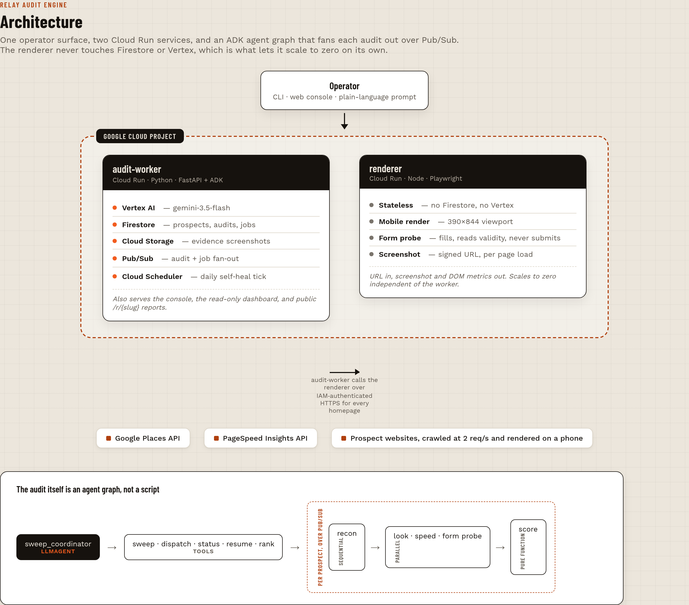

# Relay Audit Engine

**An agentic prospecting system for Relay for Roofers.** It ingests a metro, screens
a hundred residential roofing contractors for fit, audits every survivor across
roughly 35 checks, scores and segments them, and hands back a ranked call list with
a shareable one-page report per prospect. Findings are drafted by a model and
approved by a human before anything is sent.

Built for the **All Things Agentic Hackathon** (Devpost, Google), track
**Taskmaster**. The hackathon entry and the production tool are the same codebase.



## What it measures

Every audited site is scored out of 100 across three questions a homeowner answers
in order, then routed by the *shape* of its problem rather than its raw score:

| Section | Question | Weight |
|---|---|---|
| **Found** | Can a homeowner searching for a roofer find this company at all? | 30 |
| **Chosen** | Once found, do they look like the safe choice? | 30 |
| **Booked** | If someone raises a hand, is anything set up to catch it? | 40 |

Booked carries the most weight on purpose: it is the section nobody else audits, and
the one that loses jobs invisibly. A company that is easy to find but whose leads
slip away (**Leaky Bucket**) ranks ahead of a company with a higher total score,
because it is the faster, easier conversation.

Full criteria and thresholds: [`docs/found-to-booked-audit-spec.md`](docs/found-to-booked-audit-spec.md).
Technical contract: [`docs/engine-spec.md`](docs/engine-spec.md).
Working rules (never submit a form, no invented numbers, suppression before every
outreach action, and the rest): [`CLAUDE.md`](CLAUDE.md).

## Architecture

```
                     ┌───────────────────────────┐
                     │   Operator (CLI / web)    │
                     └─────────────┬─────────────┘
                                   │
      ┌────────────────────────────▼────────────────────────────┐
      │  Google Cloud project                                   │
      │                                                          │
      │   audit-worker (Cloud Run, Python, FastAPI + ADK)        │
      │     ├── Vertex AI          gemini-3.5-flash              │
      │     ├── Firestore          prospects, audits, jobs       │
      │     ├── Cloud Storage      evidence (screenshots)        │
      │     ├── Pub/Sub            audit + job fan-out           │
      │     └── Cloud Scheduler    daily self-heal tick          │
      │                                                          │
      │   renderer (Cloud Run, Node, Playwright)                 │
      │     stateless: URL in, screenshot + DOM metrics out      │
      └──────────────────────────────────────────────────────────┘
                │                │                │
         Places API       PageSpeed API    Prospect websites
```

The renderer never touches Firestore or Vertex. URL in, screenshot and metrics out,
no state. That is what lets it scale to zero independently of the agent service.

**The audit itself is an ADK agent graph**, not a script:

```
sweep_coordinator (LlmAgent)
  ├── sweep_market, dispatch_audits, batch_status, resume_batch, wait,
  │   rank_call_list      tools, the coordinator's only way to affect anything
  └── audit_agent (SequentialAgent, fanned out per prospect over Pub/Sub)
        ├── recon                     robots → homepage → sitemap → key pages
        ├── inspector (ParallelAgent) look (render + vision) | speed | form probe
        └── score                     pure function over ~35 checks
```

Only four components ever call a model: the coordinator, the vision read, the
diagnostician that drafts findings, and (planned) an opener. Everything else is a
plain function — a check that only calls an API and returns a number is a tool, not
an agent.

## Stack

| Layer | Choice |
|---|---|
| Models | Gemini 3.5 Flash via Vertex AI |
| Agent framework | Google ADK (Python) |
| Runtime | Cloud Run, two services |
| Data | Firestore |
| Events | Pub/Sub, Cloud Scheduler |
| Storage | Cloud Storage |
| Browser | Playwright, separate Node service |
| Operator surface | CLI (`typer`) and a small server-rendered web console (`FastAPI`) |

## Repository layout

```
app/
  agents/         audit_graph.py (the ADK graph), coordinator.py, vision.py, diagnostician.py
  checks/         one function per check (base.py, onpage.py, rendered.py, speed.py, vision.py, booked.py)
  console/        the operator web app: routes.py, views.py, auth.py
  report/         the public one-page report + the read-only dashboard
  store/          Firestore access (firestore.py) and GCS evidence (evidence.py)
  tools/          crawl.py, places.py, pagespeed.py, render.py, phones.py, pubsub.py
  gate.py         the fit gate, a pure function
  scoring.py      the pure scoring function, 100% test coverage
  ranker.py       call-list ordering by segment, not raw score
  pipeline.py     orchestration shared by the CLI and the ADK graph
  tasks.py        per-prospect audit claim/lease/renew, survives a killed worker
  jobs.py         long-running operator jobs (sweep, dispatch, draft, agent runs)
  worker.py       the FastAPI app: Pub/Sub push handlers, console, dashboard, report
  cli.py          the operator CLI
renderer/         the Playwright render service (Node)
docs/             engine-spec.md, found-to-booked-audit-spec.md, architecture.png
tests/            580 tests, no network calls, fixture-driven
```

## One-time Google Cloud setup

Everything below targets a single project. Replace `relay-roof-check` with your
own project id throughout.

```bash
export PROJECT_ID=relay-roof-check
export REGION=us-central1
gcloud config set project "$PROJECT_ID"
```

### 1. Enable the APIs

```bash
gcloud services enable \
  aiplatform.googleapis.com firestore.googleapis.com run.googleapis.com \
  pubsub.googleapis.com cloudscheduler.googleapis.com storage.googleapis.com \
  secretmanager.googleapis.com places.googleapis.com pagespeedonline.googleapis.com \
  cloudbuild.googleapis.com artifactregistry.googleapis.com iamcredentials.googleapis.com \
  billingbudgets.googleapis.com
```

### 2. Firestore, in Native mode

```bash
gcloud firestore databases create --location=nam5 --project="$PROJECT_ID"

gcloud firestore indexes composite create \
  --collection-group=audits --query-scope=COLLECTION \
  --field-config=field-path=batch_id,order=ascending \
  --field-config=field-path=segment,order=ascending \
  --field-config=field-path=scores.booked,order=ascending

gcloud firestore indexes composite create \
  --collection-group=prospects --query-scope=COLLECTION \
  --field-config=field-path=market_id,order=ascending \
  --field-config=field-path=gate_result,order=ascending \
  --field-config=field-path=suppressed,order=ascending
```

(Both are also declared in [`infra/firestore.indexes.json`](infra/firestore.indexes.json)
for `gcloud firestore deploy`.)

### 3. Service accounts, least privilege per service

```bash
# The audit worker: Vertex, Firestore, and it publishes to Pub/Sub.
gcloud iam service-accounts create relay-worker --display-name="Relay audit worker"
gcloud projects add-iam-policy-binding "$PROJECT_ID" \
  --member="serviceAccount:relay-worker@$PROJECT_ID.iam.gserviceaccount.com" \
  --role=roles/aiplatform.user
gcloud projects add-iam-policy-binding "$PROJECT_ID" \
  --member="serviceAccount:relay-worker@$PROJECT_ID.iam.gserviceaccount.com" \
  --role=roles/datastore.user
gcloud projects add-iam-policy-binding "$PROJECT_ID" \
  --member="serviceAccount:relay-worker@$PROJECT_ID.iam.gserviceaccount.com" \
  --role=roles/pubsub.publisher

# The renderer: no Firestore, no Vertex. Stateless, so it needs nothing but its
# own secret (granted in step 4).
gcloud iam service-accounts create relay-renderer --display-name="Relay renderer (stateless)"

# Pub/Sub push authenticates to Cloud Run as this identity.
gcloud iam service-accounts create relay-pubsub-push --display-name="Pub/Sub push identity"
gcloud run services add-iam-policy-binding audit-worker --region="$REGION" \
  --member="serviceAccount:relay-pubsub-push@$PROJECT_ID.iam.gserviceaccount.com" \
  --role=roles/run.invoker
AGENT="service-$(gcloud projects describe $PROJECT_ID --format='value(projectNumber)')@gcp-sa-pubsub.iam.gserviceaccount.com"
gcloud iam service-accounts add-iam-policy-binding relay-pubsub-push@$PROJECT_ID.iam.gserviceaccount.com \
  --member="serviceAccount:$AGENT" --role=roles/iam.serviceAccountTokenCreator
```

No key files anywhere. Cloud Run supplies these identities' credentials
automatically; a workstation uses Application Default Credentials (step 6).

### 4. Secrets

```bash
gcloud secrets create places-api-key --data-file=- <<< "$YOUR_PLACES_KEY"
gcloud secrets create renderer-shared-secret --data-file=- <<< "$(python3 -c 'import secrets;print(secrets.token_urlsafe(32))')"
gcloud secrets create worker-shared-secret   --data-file=- <<< "$(python3 -c 'import secrets;print(secrets.token_urlsafe(32))')"
gcloud secrets create console-password       --data-file=- <<< "a password you will type into a browser"
gcloud secrets create report-ip-salt         --data-file=- <<< "$(python3 -c 'import secrets;print(secrets.token_urlsafe(24))')"

for s in places-api-key renderer-shared-secret worker-shared-secret console-password report-ip-salt; do
  gcloud secrets add-iam-policy-binding "$s" \
    --member="serviceAccount:relay-worker@$PROJECT_ID.iam.gserviceaccount.com" \
    --role=roles/secretmanager.secretAccessor
done
gcloud secrets add-iam-policy-binding renderer-shared-secret \
  --member="serviceAccount:relay-renderer@$PROJECT_ID.iam.gserviceaccount.com" \
  --role=roles/secretmanager.secretAccessor
```

`worker-shared-secret` authenticates Pub/Sub's server-to-server pushes.
`console-password` is what a person types into the browser — a separate secret on
purpose, so rotating one never affects the other.

### 5. Cloud Storage, Pub/Sub, budget

```bash
# Evidence bucket. Public access prevention on; every screenshot is served
# through a signed URL minted per page load, never a public object.
gcloud storage buckets create "gs://$PROJECT_ID-evidence" --location="$REGION" \
  --uniform-bucket-level-access --public-access-prevention
gcloud storage buckets add-iam-policy-binding "gs://$PROJECT_ID-evidence" \
  --member="serviceAccount:relay-worker@$PROJECT_ID.iam.gserviceaccount.com" \
  --role=roles/storage.objectAdmin
# Signed URLs are minted by the worker's own identity via the IAM Credentials
# API, not a key file, so it needs to sign as itself.
gcloud iam service-accounts add-iam-policy-binding relay-worker@$PROJECT_ID.iam.gserviceaccount.com \
  --member="serviceAccount:relay-worker@$PROJECT_ID.iam.gserviceaccount.com" \
  --role=roles/iam.serviceAccountTokenCreator

# Audit fan-out: topic, push subscription (created after the worker is deployed
# in step 7, since the subscription needs its URL), and a dead-letter topic.
gcloud pubsub topics create run-audit
gcloud pubsub topics create run-audit-dlq
gcloud pubsub topics create run-job

# A $50 budget alert, per the cost-control rule.
BILLING=$(gcloud billing projects describe "$PROJECT_ID" --format='value(billingAccountName)')
gcloud billing budgets create --billing-account="${BILLING#billingAccounts/}" \
  --display-name="relay-audit-engine cap" --budget-amount=50USD \
  --threshold-rule=percent=0.5 --threshold-rule=percent=0.9 --threshold-rule=percent=1.0 \
  --filter-projects="projects/$PROJECT_ID"
```

### 6. Local development environment

```bash
python3.11 -m venv .venv
source .venv/bin/activate
pip install -r requirements.txt

gcloud auth application-default login   # Vertex AI and Firestore read this

cp .env.example .env   # fill in project id, the API keys above, and the secret values
```

`gemini-3.5-flash` is served from the **global** Vertex endpoint only and 404s on a
regional one (`us-central1`, where Firestore and Cloud Run live). That is why
`.env` carries both `GOOGLE_CLOUD_LOCATION` and a separate `VERTEX_MODEL_LOCATION`
— do not collapse them into one variable.

Confirm everything answers before doing anything else:

```bash
python -m app.cli doctor
```

This makes one real call each to Vertex, Firestore, and Places, and prints
pass/fail for each rather than assuming.

## Running a sweep from the CLI

```bash
# Seed the ~35 check definitions into Firestore. Re-running preserves any
# weight you have already retuned there; --force overwrites from code.
python -m app.cli seed-checks

# Ingest a metro and run the fit gate on every prospect Places returns.
python -m app.cli sweep "Colorado Springs" --limit 100

# Fan the gated survivors out over Pub/Sub, four at a time, politely.
python -m app.cli dispatch <batch-id> --market "Colorado Springs"

# Watch it land.
python -m app.cli batch <batch-id>

# The ranked call list, and draft talking points for the top 10.
python -m app.cli call-list <batch-id> --draft 10

# A human reads the draft, then:
python -m app.cli approve <audit-id>
python -m app.cli publish <audit-id>
```

Or hand the whole job to the ADK coordinator in one sentence:

```bash
python -m app.cli agent "Sweep Colorado Springs, audit the top 20, hand me the ranked call list."
```

`python -m app.cli --help` lists every command; each has its own `--help`.

## Deploying the two Cloud Run services

```bash
# The renderer. IAM-protected; only relay-worker and you can invoke it.
gcloud run deploy renderer --source renderer/ --region "$REGION" \
  --service-account relay-renderer@$PROJECT_ID.iam.gserviceaccount.com \
  --memory 2Gi --cpu 2 --min-instances 0 --max-instances 2 --concurrency 2 --timeout 120 \
  --no-allow-unauthenticated \
  --set-secrets RENDERER_SHARED_SECRET=renderer-shared-secret:latest

RENDERER_URL=$(gcloud run services describe renderer --region "$REGION" --format='value(status.url)')

# The audit worker. Public: Pub/Sub push and the public /r/{slug} reports both
# need to reach it without a bearer token. The console and dashboard are gated
# by CONSOLE_PASSWORD regardless of Cloud Run's own IAM.
gcloud run deploy audit-worker --source . --region "$REGION" \
  --service-account relay-worker@$PROJECT_ID.iam.gserviceaccount.com \
  --memory 1Gi --cpu 1 --min-instances 0 --max-instances 3 --concurrency 2 --timeout 900 \
  --allow-unauthenticated \
  --set-env-vars "GOOGLE_GENAI_USE_VERTEXAI=TRUE,GOOGLE_CLOUD_PROJECT=$PROJECT_ID,GOOGLE_CLOUD_LOCATION=$REGION,VERTEX_MODEL_LOCATION=global,GEMINI_MODEL=gemini-3.5-flash,RENDERER_URL=$RENDERER_URL,PUBSUB_AUDIT_TOPIC=run-audit,PUBSUB_JOB_TOPIC=run-job,GCS_EVIDENCE_BUCKET=$PROJECT_ID-evidence" \
  --set-secrets "GOOGLE_PLACES_API_KEY=places-api-key:latest,PAGESPEED_API_KEY=places-api-key:latest,RENDERER_SHARED_SECRET=renderer-shared-secret:latest,WORKER_SHARED_SECRET=worker-shared-secret:latest,REPORT_IP_SALT=report-ip-salt:latest,CONSOLE_PASSWORD=console-password:latest"

WORKER_URL=$(gcloud run services describe audit-worker --region "$REGION" --format='value(status.url)')
```

If your organization enforces a domain-restricted-sharing policy,
`--allow-unauthenticated` will fail until it is relaxed for the project:

```bash
cat > /tmp/policy.yaml <<'EOF'
name: projects/PROJECT_ID/policies/iam.allowedPolicyMemberDomains
spec:
  rules:
    - allowAll: true
EOF
gcloud org-policies set-policy /tmp/policy.yaml
```

Then wire the push subscriptions, now that the worker has a URL:

```bash
WSECRET=$(gcloud secrets versions access latest --secret=worker-shared-secret)

gcloud pubsub subscriptions create run-audit-push --topic run-audit \
  --push-endpoint "$WORKER_URL/pubsub/audit?token=$WSECRET" \
  --push-auth-service-account "relay-pubsub-push@$PROJECT_ID.iam.gserviceaccount.com" \
  --ack-deadline 600 --dead-letter-topic run-audit-dlq --max-delivery-attempts 5

gcloud pubsub subscriptions create run-job-push --topic run-job \
  --push-endpoint "$WORKER_URL/pubsub/job?token=$WSECRET" \
  --push-auth-service-account "relay-pubsub-push@$PROJECT_ID.iam.gserviceaccount.com" \
  --ack-deadline 600 --dead-letter-topic run-audit-dlq --max-delivery-attempts 20

# The daily self-heal tick: republishes anything whose lease lapsed overnight.
gcloud scheduler jobs create http daily-tick --location "$REGION" \
  --schedule "0 13 * * *" --time-zone "America/Denver" --http-method POST \
  --uri "$WORKER_URL/tick?token=$WSECRET" \
  --oidc-service-account-email "relay-pubsub-push@$PROJECT_ID.iam.gserviceaccount.com"
```

## Using the web console

The same audit-worker service also serves an operator web app, gated by
`CONSOLE_PASSWORD` (not Cloud Run IAM — that stays public for Pub/Sub and public
reports):

```
https://<worker-url>/console?key=<CONSOLE_PASSWORD>
```

Visiting once converts the key into a session cookie and redirects to a clean URL,
so the password never sits in browser history after the first visit. From there:
**Start a scan** → **Results** (the ranked call list, filterable by any check) →
open a company → **Write talking points** → a human approves → **Create the
shareable report**. `/dashboard` is the same data, read-only, with no buttons —
useful for a screen nobody should be able to act from.

Long jobs (a sweep, a coordinator run) are backed by Pub/Sub the same way audits
are: the browser starts a job and polls it, so a slow sweep survives closing the
tab and the worker instance that started it being recycled.

## Testing

```bash
pytest                                    # 580 tests, no network calls, seconds to run
pytest --cov=app.scoring --cov=app.gate   # the two modules held to 100% coverage
```

Every check is tested against a fixture, never a live fetch. Several tests exist
specifically because a real prospect's website broke an assumption in production —
those are named for what they regression-test, not just what they assert.

## Guardrails enforced in code, not just in the docs

- **Never submits a form.** The renderer's form-health probe fills fields and reads
  `checkValidity()`; there is no code path that calls `.submit()`, and a test scans
  the renderer source to prove it.
- **robots.txt is respected.** Disallowed means the check is skipped and noted,
  never bypassed, and the crawler never spoofs its user agent.
- **No invented numbers.** Absent fields stay absent in Firestore (`_plain()` drops
  `None` rather than writing `null`); nothing defaults to zero.
- **Suppression is checked before every outreach action**, draft generation
  included, matched on place id, domain, phone, and email.
- **Findings are exactly three, and a human approves them before a report can
  exist** — enforced by a runtime assertion and a Firestore status field the
  publish path checks, not just by convention.
- **Public reports carry no scores, bands, or segments.** A test walks the
  serialized payload for the internal vocabulary and fails the build if any of it
  leaked through.
- **No em-dashes in anything a contractor reads.** Checked twice: the model is
  asked not to, and the rendered page is scanned before it can publish.

## Status

35 of 35 enabled checks implemented. Full pipeline (sweep → gate → audit → draft →
approve → publish) runs end to end, including through a killed worker and a
resumed batch. 580 tests passing. See [`CLAUDE.md`](CLAUDE.md) for the day-by-day
build log and the cut list of checks deliberately left for after the deadline.
